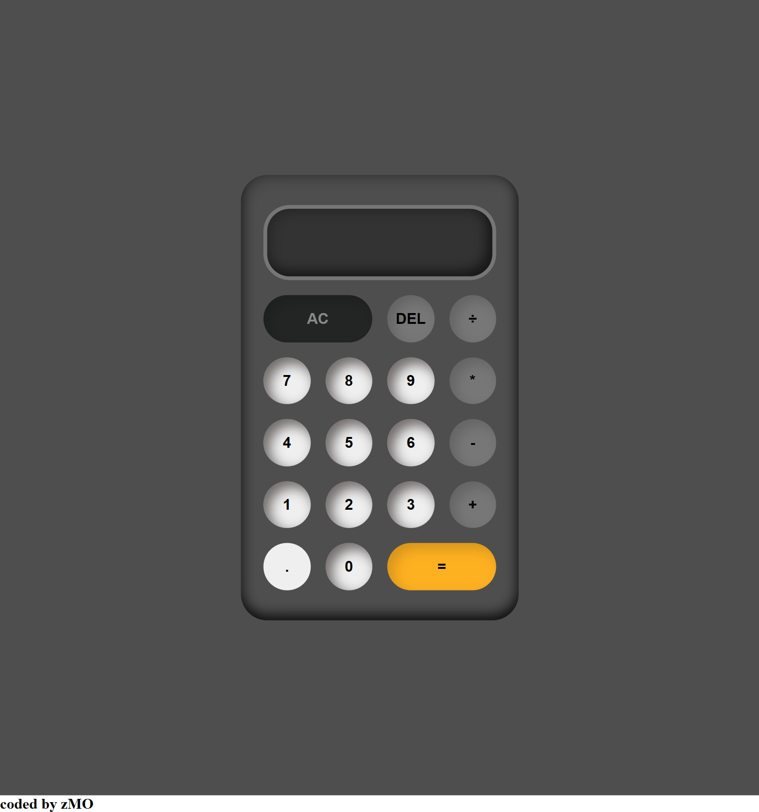

# Calculator App 2023

A simple calculator app built in 2023, utilizing object-oriented programming (OOP) concepts and vanilla JavaScript for rendering. The app features basic arithmetic operations and a user-friendly interface.

## Features

- **Object-Oriented Design:** The calculator is designed using OOP principles, making the codebase modular and maintainable.
- **Arithmetic Operations:** Perform addition, subtraction, multiplication, and division with ease.
- **Responsive Design:** The app's user interface adapts seamlessly to various screen sizes.
- **Custom CSS Styling:** The app is styled using custom CSS for a polished and visually appealing look.

## Technologies Used

- HTML
- CSS
- Vanilla JavaScript

## Demo

Check out the live demo of the Calculator App [here](https://github.com/Callmesauce/Calculator2023.git).

## Getting Started

1. Clone the repository: `git clone https://github.com/Callmesauce/Calculator2023.git`
2. Open the `index.html` file in your preferred web browser.

## Usage

1. Use the calculator buttons to input numbers and perform calculations.
2. Click on arithmetic operation buttons (+, -, \*, /) to select the desired operation.
3. Press the "Equals" button (=) to display the result of the calculation.
4. Clear the current input using the "Clear" button (C).

## Screenshots

_Description of the screenshot._

## Contributing

Contributions are welcome! Feel free to fork the repository and submit pull requests.

## License

This project is licensed under the [MIT License](LICENSE).
